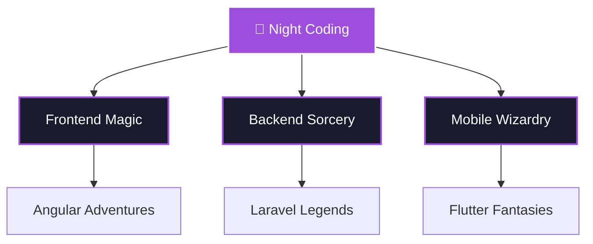

# 🌙 Welcome to my Domain

<div align="center">
  
</div>

<div align="center">
  
</div>

---

## 🌟 About Me

```typescript
const developer = {
  name: "Zarathustra",
  location: "Coding in the moonlight",
  timezone: "Always coding somewhere",
  currently: "Building digital dreams",
  passion: ["Clean Code", "Night Coding", "Problem Solving"],
  motto: "Code by night, dream by day"
};
```

---

## 🏆 Achievements in the Dark

<div align="center">
  
</div>

---

## 🛠️ Arsenal of the Night

<div align="center">

### Frontend Sorcery


### Backend Mastery  


### Mobile Wizardry


### Database & Cloud


### Tools & Workflow


</div>

---

## 📊 Night Coding Statistics

<div align="center">
  
  
</div>

<div align="center">
  
</div>

---

## 🌃 Current Focus

<div align="center">



</div>

---

## 🎯 Let's Connect Under the Stars

<div align="center">
  <a href="https://github.com/zarathustra09">
    
  </a>
  <a href="mailto:your.email@example.com">
    
  </a>
</div>

---

<div align="center">
  
</div>

<div align="center">
  <i>✨ "In the darkness of night, code becomes poetry" ✨</i>
</div>
