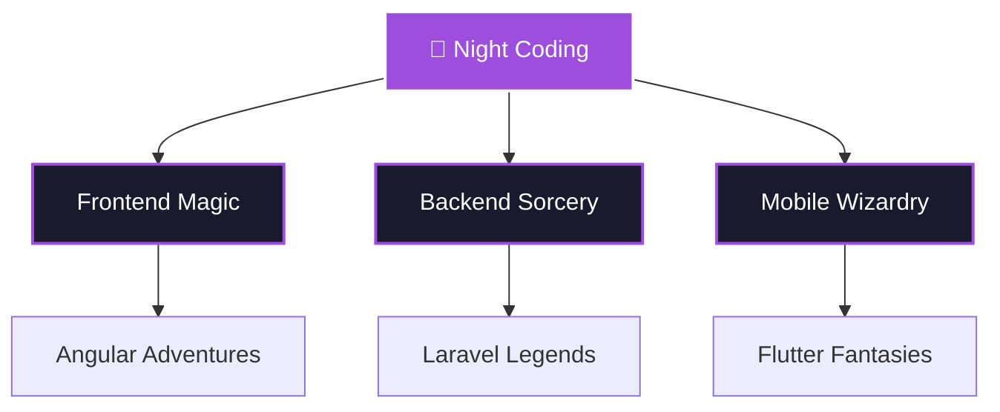

# 🌙 Welcome to my Domain

  

  

```mermaid
graph TD
    A[🌙 Night Coding] --> B[Frontend Magic]
    A --> C[Backend Sorcery]
    A --> D[Mobile Wizardry]
    B --> E[Angular Adventures]
    C --> F[Laravel Legends]
    D --> G[Flutter Fantasies]
    
    style A fill:#9d4edd,stroke:#ffffff,stroke-width:2px,color:#ffffff
    style B fill:#1a1a2e,stroke:#9d4edd,stroke-width:2px,color:#ffffff
    style C fill:#1a1a2e,stroke:#9d4edd,stroke-width:2px,color:#ffffff
    style D fill:#1a1a2e,stroke:#9d4edd,stroke-width:2px,color:#ffffff
```

---

## 🎯 Let's Connect Under the Stars

  
  

---

  

  <i>✨ "In the darkness of night, code becomes poetry" ✨</i>

